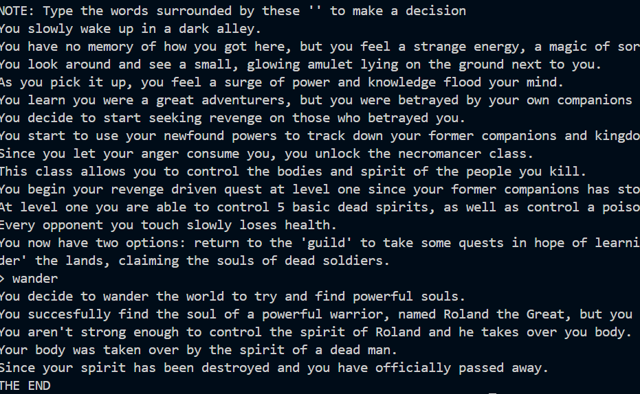
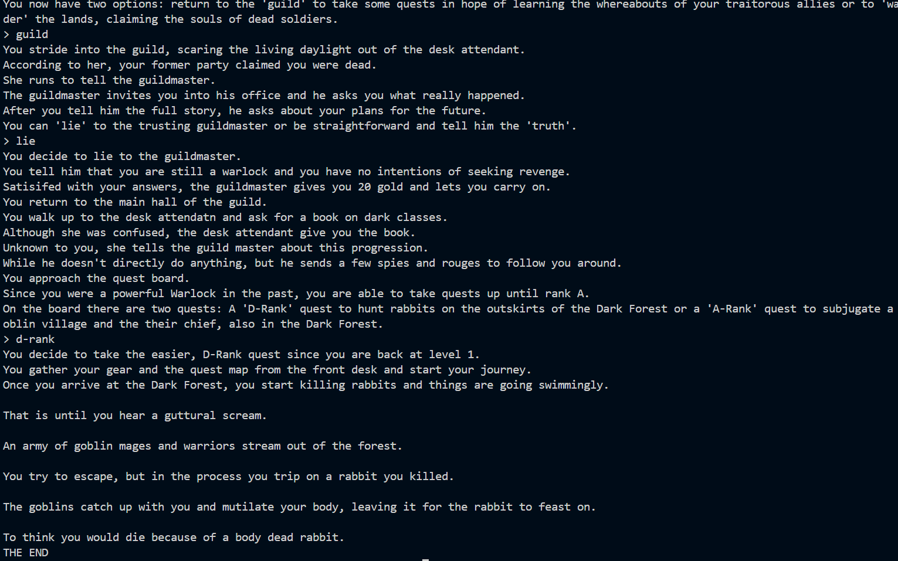

# The Inevitable End of the Necromancer

## Description

The Inevitable End of the Necromancer is a text-based adventure game written in Python.

You play as a  warlock who was betrayed by both his teammates and his kingdom. Consumed by rage, he awakens as a Necromancer and begins his quest for revenge.

Your choices determine how your story unfolds.

- Return to The Guild or wander the world.
- Decide whether to lie to the guildmaster or reveal the truth.
- If you choose to lie, you can join the mysterious Dark Guild and discover its dangerous missions.
- Solve riddles, battle enemies, and face the consequences of every decision.

No matter which path you choose, life as a necromancer is dangerous, and every choice could lead to death.

---

## Features

- Multiple branching storylines
- Interactive player choices
- RPG-inspired fantasy setting
- Uses Python's `time` library to create dramatic pauses with `time.sleep()`

---

## Technologies Used

- Python 3
- `time` module

---

## Installation

Clone this repository:

```bash
git clone https://github.com/Dragoman23/The_Inevitable_End_of_the_Necromancer.git
```

Move into the project folder:

```bash
cd The_Inevitable_End_of_the_Necromancer
```

Run the game:

```bash
python The_Inevitable_End_of_the_Necromancer_game_code.py
```

If your computer uses Python 3:

```bash
python3 The_Inevitable_End_of_the_Necromancer_game_code.py
```

---

## Gameplay

The game is entirely text-based.

Simply read the story and type the prompted choices exactly as shown to progress through the adventure.

Link to Gameplay Demo: https://youtu.be/7VcHQxcoBoA?si=jubN4lRBywCK4lDA

---

## Screenshots






---

## Future Improvements

- Complete the Hero storyline
- Add a leveling system
- Expand combat mechanics
- Save/load game functionality

---

## Author

Created by **Ram Kondapalli**
